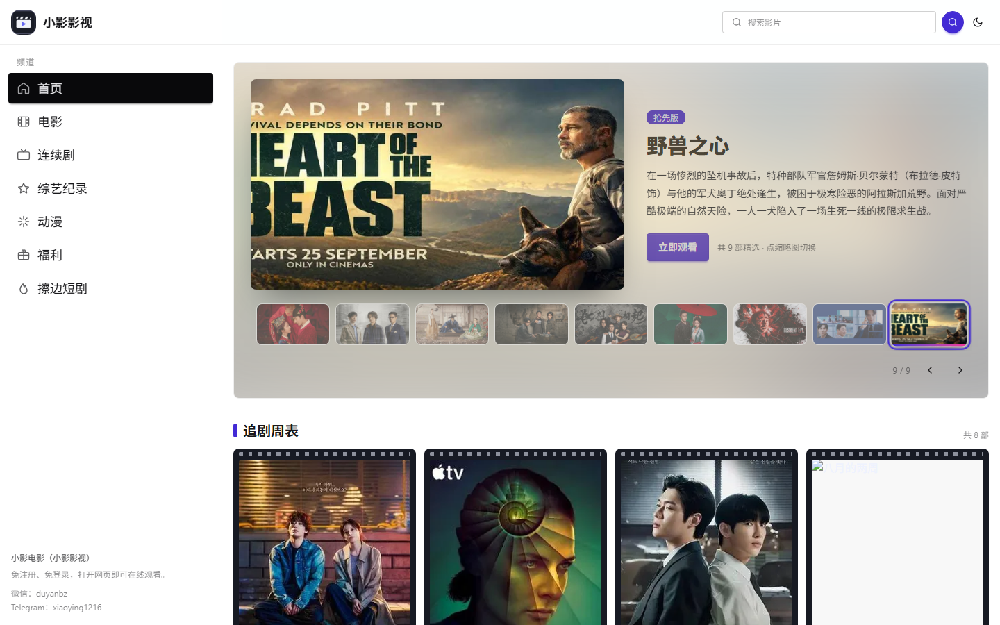
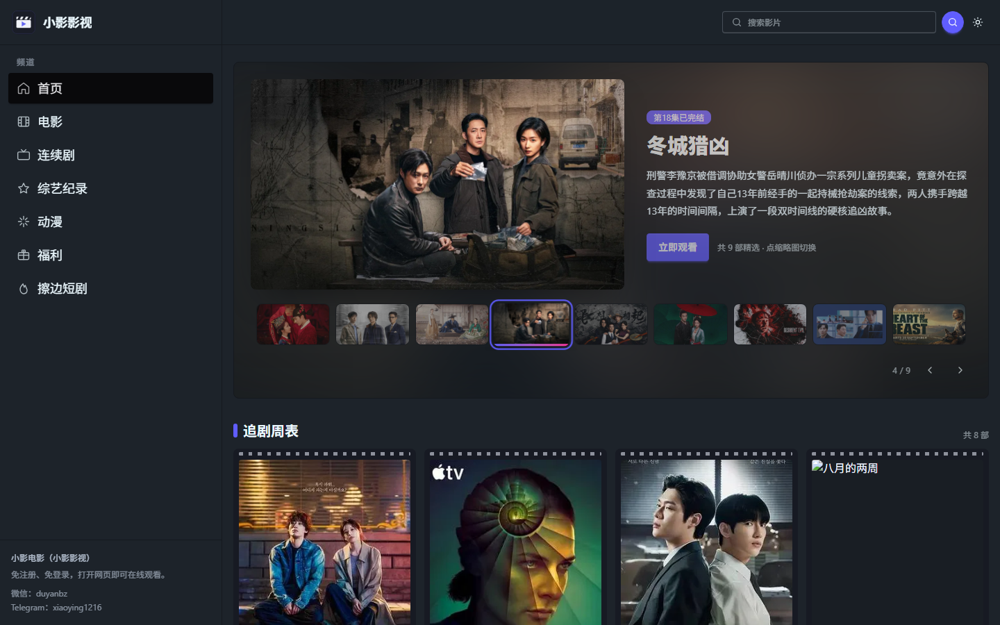
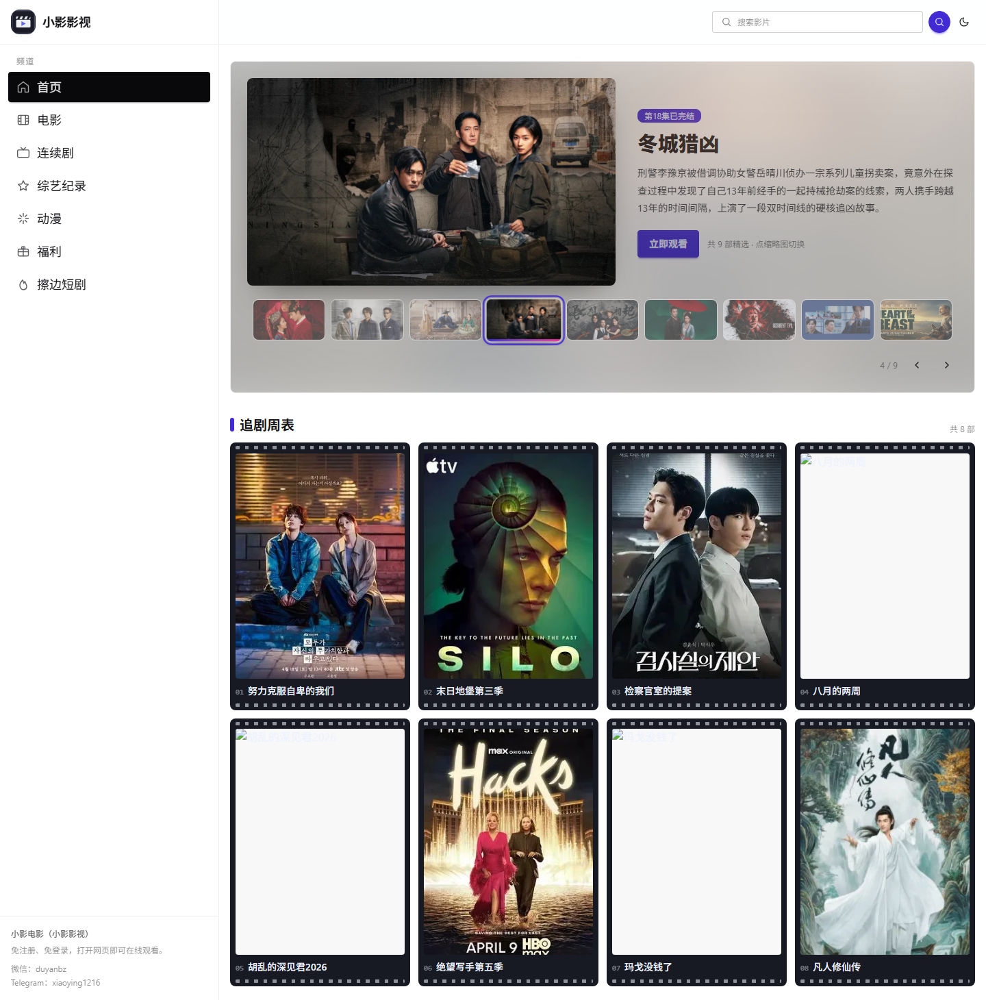
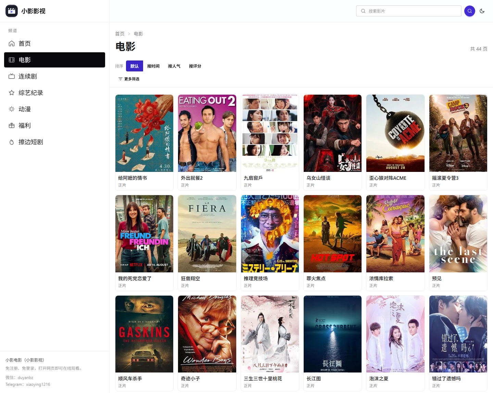
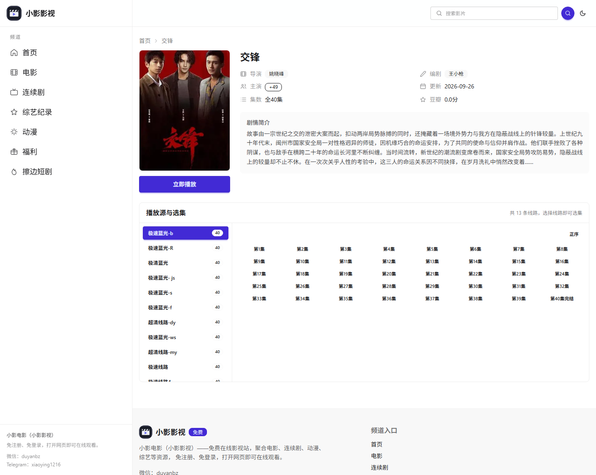
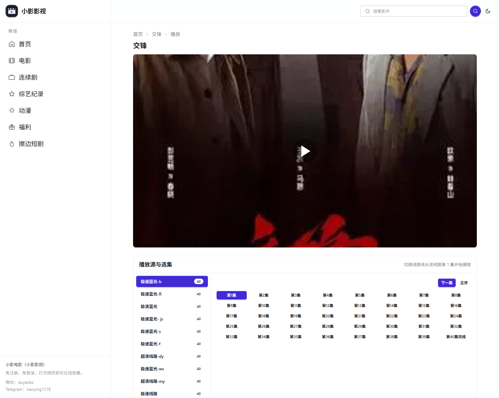
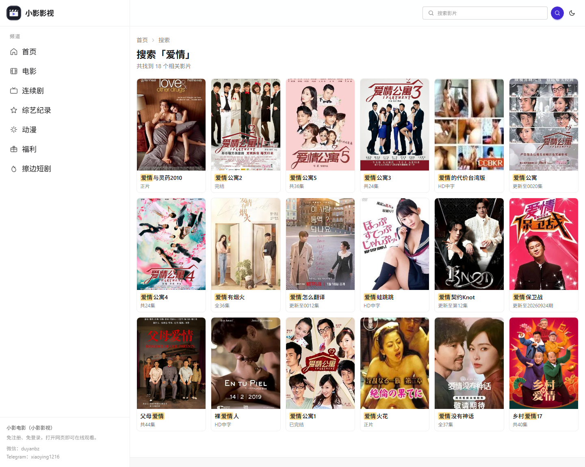
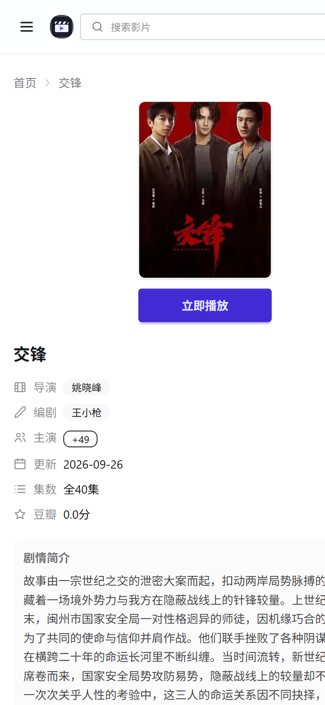

# Prazer · 快感

**基于小影 API 的影视站前端：只做「好看的壳 + 稳健的取数」**

Django 6 · Tailwind CSS 4 · daisyUI 5 · 零前端框架 · 零数据库落库

---

## 这是什么

一个**服务端渲染的影视站**。影片数据、播放地址、友情链接全部来自 [小影 API](https://xiaoyingapi.com/docs/movie/)，
本站不做采集、不存片、不转码、不落库，只负责：

- 把接口数据渲染成好看的页面（首页 / 分类 / 详情 / 播放 / 搜索 共 5 类）
- 把接口的抖动挡在访客之外（多级缓存 + 陈旧兜底 + 失败降级）
- 把第三方海报换成自家地址（本地缓存 + 压缩 + 签名防滥用）
- 把 SEO 该给的东西给全（伪静态、canonical、结构化数据、sitemap）

> 需求原点见 [`docs/项目需求/我想做什么.md`](docs/项目需求/我想做什么.md)：
> 「主打免费流畅的观影体验，基于小影 API，我们负责前端显示」。

---

## 页面速览

### 首页（PC）

剧场式轮播：左侧横版大图 + 右侧影片信息 + 底部缩略图条（当前项带自动轮播进度条，每 5 秒一张）。
切换是「抽卡」式动效——旧图先抬起、再带着旋转缩小抽走，新图从另一侧滑入，两层始终盖满画框、不露底色。



### 首页（深色主题）

页头右上角一键切换深浅色，选择记在 `localStorage`，首屏由内联脚本提前定好主题，不会闪白。



### 首页板块（胶片格卡片）

每个分类区块是杂志式榜单：`TOP 1` 大卡 + `2~8` 序号小卡。卡片做成影院胶片格（片框 + 上下齿孔 + 两位编号），
鼠标经过只盖一层「查看详情」遮罩，卡片本身不做位移/缩放/阴影变化。首页共 10 个区块、80 部影片。



### 分类列表（动态筛选）

筛选项全部由接口的 `/filters` 驱动：子分类、地区、题材、语言、年份、排序（默认/时间/人气/评分）。
选项**不写死在前端**，且服务端会把用户传来的值对着接口返回的可选值做白名单收敛，然后拼进 URL，翻页时条件不丢。



### 影视详情

多线路用双栏面板承载：左侧线路栏（带线路名与集数），右侧选集区（每 50 集一档，可整体倒序）。
信息区每行带图标（导演=场记板、编剧=笔、主演=人物、更新=日历、片长=时钟、豆瓣=星标），
主演/编剧超过 8 个折叠成「+N」，展开后显示全部并可「收起」。



### 播放页

播放器用 **xgplayer 3 + HLS 插件**（本地托管，不依赖外部 CDN），下方复用选集面板，可「上一集 / 下一集」。
手机端支持平台级手势：**左右滑动调进度**（滑动时预览时间）、单击呼出控制栏、双击暂停、长按 2 倍速、
右半边上下滑调音量 / 左半边调亮度。播放失败会给出明确提示，不黑屏空转。



### 搜索结果

关键词在片名里高亮（`<mark>`），无结果时给引导文案而不是空白页。



### 移动端

窄屏自动换形态：轮播从「剧场式」变成原生横滑图集（`scroll-snap`，可惯性滑动）、
侧边栏收进汉堡抽屉、列表与详情单列排布。圆点指示带不可见的大热区（视觉 6px、热区 22px），点得准。

| 移动端首页 | 移动端详情 |
|---|---|
|  |  |

---

## 功能特性

**页面与交互**

- 首页：剧场式轮播（PC）+ 原生横滑图集（移动）、胶片格榜单卡片、10 个分类区块
- 列表页：动态筛选（子分类/地区/题材/语言/年份/排序）+ 分页 + 筛选条件 URL 保持
- 详情页：多线路双栏面板、选集分档（50 集/档）、正序倒序、主演折叠标签、信息行图标
- 播放页：xgplayer 3 + xgplayer-hls 插件、手机手势、上一集/下一集、失败提示
- 搜索页：结果高亮、空搜索友好提示
- 全站：左侧栏导航（PC 常驻 / 移动抽屉）、深浅色主题切换、回到顶部、自定义 404/500

**性能**

- GZip（首页 HTML 约 130 KB → 约 15 KB）
- 图片代理：第三方海报 → 本地 webp（限宽 1080、质量 82）+ 30 天强缓存；首屏主图 `preload`
- 播放器与 HLS 插件本地托管，不请求第三方 CDN
- `output.css` 只编入用到的类（Tailwind `source(none)` + 精确 `@source`）

**稳定与安全**

- 接口超时 4 秒（播放接口 10 秒），失败一律降级，不把异常抛给页面
- 三级缓存：数据 6 小时 / 播放地址 30 分钟 / 搜索 30 分钟，外加 7 天「陈旧兜底」备份
- 图片代理地址带 HMAC 签名（密钥取 `SECRET_KEY`），不会被当成免费图床或内网探测跳板
- 友情链接在服务端渲染进 HTML（供爬虫可见），外链替换带 `html.escape` 防属性注入
- 38 个离线测试（不依赖小影接口是否可用），覆盖签名、清洗、降级、兜底、页面渲染、图片代理

**SEO**

- 全站伪静态（`/list/2.html`、`/detail/809444.html`、`/so/爱情.html`）
- canonical 只用 `path`（避免 `?utm_source=` 之类参数被当成不同页面）
- Open Graph（含 `og:image`，详情页覆盖为影片海报）、JSON-LD（`WebSite` + `Movie`）
- `sitemap.xml` 动态收集真实详情页 URL、`robots.txt`、筛选页与空数据页自动 `noindex`

---

## 技术栈

| 分层 | 选型 |
|---|---|
| 运行时 | Python 3.14 / Django 6.1（WSGI） |
| 样式 | Tailwind CSS 4 + daisyUI 5（独立编译器，无 Node 依赖） |
| 播放器 | xgplayer 3.0.26 + xgplayer-hls（本地静态文件） |
| 取数与图片 | requests（HMAC-SHA256 签名）、Pillow（webp 转码） |
| 缓存 | Django `FileBasedCache`（`cache/` 目录，不依赖 Redis） |
| 生产服务 | waitress（纯 Python WSGI，跨平台） |

前端无框架：全部是 HTML 模板 + 三个原生 JS 文件（`common.js` / `hero.js` / `player_picker.js`）。

---

## 快速开始

### 1. 准备环境

需要 Python 3.12 以上（实测 3.14.5）。

```powershell
# Windows（PowerShell）
python -m venv .venv
.venv\Scripts\python.exe -m pip install -r requirements.txt
```

```bash
# macOS / Linux
python3 -m venv .venv
.venv/bin/python -m pip install -r requirements.txt
```

### 2. 配置 `.env`

在项目根目录创建 `.env`（该文件已在 `.gitignore` 中，不会入库）：

```ini
# ---- Django 核心 ----
SECRET_KEY=请换成一段足够长的随机字符串
DEBUG=False
ALLOWED_HOSTS=127.0.0.1,你的域名.com

# ---- 小影 API（切线上/本地只改这一处）----
XIAOYING_API_BASE=https://xiaoyingapi.com
XIAOYING_API_APPID=app_你的APPID
XIAOYING_API_APPSECRET=sk_你的APPSECRET

# ---- 外链替换为友情链接：on 开启 / off 关闭（默认关闭）----
FRIEND_LINK_REPLACE=on

# ---- 缓存时长（0 表示不缓存）----
XIAOYING_MOVIE_CACHE_HOURS=6
XIAOYING_MOVIE_PLAY_CACHE_MINUTES=30
XIAOYING_MOVIE_SEARCH_CACHE_MINUTES=30

# ---- 站点品牌与联系方式（改名/换联系方式只改这里）----
SITE_NAME=Prazer
SITE_NAME_ALT=快感
# SITE_BRAND=           # 可选；SEO 文案里的品牌短语，留空则按「副名（主名）」自动拼
SITE_CONTACT_EMAIL=contact#example.com
SITE_CONTACT_WECHAT=your_wechat
SITE_CONTACT_TG=your_telegram
```

`APPID` / `APPSECRET` 的获取方式（摘自小影 API 接入向导）：先在其官网注册账号，
再联系站长开通「接入项目」，开通后会一次性展示 `app_xxx` 与 `sk_xxx`，请立即保存。
`APPSECRET` 是签名密钥，**只能放在服务端**，绝不能写进前端。

### 3. 初始化并启动

```powershell
.venv\Scripts\python.exe manage.py migrate      # 建 SQLite 表（只用 Django 内置功能，不存影片数据）
.venv\Scripts\python.exe manage.py runserver 127.0.0.1:8001
```

打开 <http://127.0.0.1:8001/> 即可。

> 本地开发时建议把 `DEBUG=True`：模板改动即时生效。
> `DEBUG=False`（默认）下 Django 会缓存模板，**改完模板必须重启进程**才看得到。

### 4. 改样式才需要重编译 CSS

`Web/static/css/output.css` 是编译产物且已入库，**正常开发/部署不需要动它**。
只有当你改了模板里的 Tailwind/daisyUI 类名，才需要重编译：

```powershell
Web\static-src\css\tailwindcss.exe -i Web\static-src\css\input.css -o Web\static\css\output.css
# 开发时加 --watch 自动重编译
```

编译器是 Tailwind 官方 standalone 可执行文件（仓库里没有它，100 MB+ 不入库）。
首次使用请从官方 Release 下载对应平台版本，放到 `Web/static-src/css/tailwindcss.exe`：

- Windows x64：`https://github.com/tailwindlabs/tailwindcss/releases/latest/download/tailwindcss-windows-x64.exe`
- Linux x64：`.../tailwindcss-linux-x64`，macOS：`.../tailwindcss-macos-arm64`（自行 `chmod +x`）

daisyUI 插件已随仓库提供（`Web/static-src/css/daisyui.mjs`），无需 npm。

---

## 环境变量一览

| 变量 | 默认值 | 说明 |
|---|---|---|
| `SECRET_KEY` | 内置不安全默认值 | **生产必须替换**；同时用作图片代理的签名密钥 |
| `DEBUG` | `False` | 开发时设 `True`（模板即时生效） |
| `ALLOWED_HOSTS` | `127.0.0.1,localhost` | 逗号分隔；上线填真实域名 |
| `XIAOYING_API_BASE` | `https://xiaoyingapi.com` | 小影 API 地址，切环境只改这一处 |
| `XIAOYING_API_APPID` | 空 | 接入项目 APPID（`app_` 开头） |
| `XIAOYING_API_APPSECRET` | 空 | 签名密钥（`sk_` 开头），未配置时接口会返回 20011，页面降级为空 |
| `FRIEND_LINK_REPLACE` | 关闭 | `on` 时把页面外链随机替换为小影友情链接（模块导入时读取，改完要重启） |
| `XIAOYING_MOVIE_CACHE_HOURS` | `6` | 分类/首页/列表/详情/筛选 缓存小时数 |
| `XIAOYING_MOVIE_PLAY_CACHE_MINUTES` | `30` | 播放地址缓存分钟数（m3u8 带时效，故较短） |
| `XIAOYING_MOVIE_SEARCH_CACHE_MINUTES` | `30` | 搜索结果缓存分钟数 |
| `SITE_NAME` / `SITE_NAME_ALT` | Prazer / 快感 | 站点主名 / 副名（SEO 标题、结构化数据） |
| `SITE_BRAND` | 自动拼 | SEO 文案里的品牌短语，留空则取「副名（主名）」 |
| `SITE_CONTACT_EMAIL` | `contact#example.com` | 页脚免责声明邮箱（用 `#` 代替 `@` 防爬虫） |
| `SITE_CONTACT_WECHAT` / `SITE_CONTACT_TG` | 空 | 页脚「联系我们」弹窗内容，留空则该项不显示 |

---

## 项目结构

```text
Prazer/
├── Prazer/                   # 项目配置
│   ├── settings.py           #   站点配置、缓存、Context Processor、中间件
│   └── urls.py               #   根路由 + robots.txt / sitemap.xml / 静态媒体服务
├── API/                      # 小影 API 接入层（唯一会发网络请求的地方）
│   ├── common/
│   │   ├── signature.py      #   HMAC-SHA256 签名、公共参数、带签名的 GET
│   │   └── status_code.py    #   接口返回码常量
│   ├── apis/movie.py         #   电影服务 7 个接口 + 缓存 + 陈旧兜底 + 文案清洗
│   └── tests.py              #   签名/清洗/降级的离线测试
├── Web/                      # 站点业务
│   ├── views/
│   │   ├── request.py        #   5 类页面视图 + sitemap + 错误页
│   │   ├── pic.py            #   图片代理（签名校验 + webp 转码 + 本地缓存 + 滚动淘汰）
│   │   └── urls.py           #   前端路由（伪静态地址）
│   ├── services/             # 视图用的取数服务
│   │   ├── movie_nav.py      #     分类导航（带图标映射 + 缓存）
│   │   ├── friend_links.py   #     友情链接（1 小时缓存，失败保留旧值）
│   │   ├── site_info.py      #     站点品牌/联系方式（从 .env 读）
│   │   └── pager.py          #     分页区间计算
│   ├── middleware.py         # 外链随机替换为友情链接（响应阶段改写 HTML）
│   ├── templatetags/xy_pic.py# 模板标签 ：把海报地址换成本站代理地址
│   ├── templates/            # 页面模板（template.html 是母版，common_html/ 是可复用片段）
│   ├── static/               # 对外静态目录（output.css / js / vendor 播放器）
│   ├── static-src/css/       # 样式源码（input.css + daisyUI 插件 + tailwind 编译器）
│   └── tests.py              #   页面渲染、降级、图片代理的离线测试
├── media/                    # logo / favicon / 兜底图 / 图片代理缓存（pic/，运行时生成）
├── docs/screenshots/         # README 截图
├── cache/                    # FileBasedCache 运行产物（删掉即清缓存）
└── requirements.txt
```

## 路由一览

| 地址 | 说明 |
|---|---|
| `/` | 首页（轮播 + 分区榜单） |
| `/list/<type_id>.html` | 分类列表第 1 页（收录用地址更干净） |
| `/list/<type_id>/<page>.html` | 分类列表第 2 页起（支持 `?order=&area=&genre=&lang=&year=` 组合筛选） |
| `/detail/<vod_id>.html` | 影片详情（多线路 + 选集） |
| `/play/<vod_id>/<sid>/<nid>.html` | 播放页（线路 sid / 集 nid） |
| `/so/<关键词>.html` | 搜索结果 |
| `/pic/<签名>.webp?u=<原图地址>` | 图片代理（模板标签自动生成，签名不符直接 404） |
| `/sitemap.xml`、`/robots.txt` | SEO |

---

## 关键设计说明

### 数据流：一次页面请求发生了什么

```text
浏览器 → Django 视图 → API/apis/movie.get_xxx()
                      ├─ 命中 cache/ 文件缓存 → 直接返回（绝大多数请求走这里）
                      └─ 未命中 → 带 HMAC 签名请求小影 API（4s 超时）
                                     ├─ 成功 → 写入缓存 + 写一份 7 天陈旧备份
                                     └─ 失败 → 取陈旧备份顶上；连备份都没有 → 返回 None，页面降级
```

- **签名口径**：除 `sign` 外全部非空参数 → 键名 ASCII 升序 → `k=v&k=v` → HMAC-SHA256（`APPSECRET` 为密钥）→ 小写 hex；公共参数 `app_id / timestamp / nonce / sign`，时间戳 ±5 分钟。
- **文案清洗**：源站部分字段带多层转义的 HTML 实体残渣（如 `&amp;amp; ;`），取数时统一反转义并清理，避免页面上出现实体垃圾。
- **为什么不落库**：本站只做展示，缓存文件足够；落库反而要处理同步、更新与版权数据留存问题。

### 图片代理：为什么海报要走 `/pic/`

全站海报原本都指向第三方（百度图床 / 源站域名），对方限速、防盗链、偶尔整站连不上都是我们控制不了的。
代理层的处理顺序：

1. 校验 HMAC 签名（不通过直接 404，杜绝被当成免费图床或内网探测跳板）
2. 本地已有 → 直接发（`Cache-Control: public, max-age=30d`）
3. 没有 → 回源一次 → 转 webp、限宽 1080 → 存盘再发
4. 回源失败 → **302 到原图地址**（最差不比不代理更糟），并把该地址记进 10 分钟「失败记忆」，
   期间不再重复回源——否则源站挂掉时，每次浏览每张图都要占着 worker 干等十几秒

磁盘占用按文件数量滚动淘汰（上限 4000 张，超过就删最旧的 20%），不引入定时任务。

### 友情链接：为什么在服务端改写

友情链接需要在 HTML 里就能被爬虫抓到，所以不能用前端 JS 去请求。
`Web/middleware.py` 在响应阶段（仅 200 + `text/html`）把外链 `href` 随机替换为小影友情链接，
锚文本只在链接内是纯文本时才替换（含图标/图片的保持原样），所有写入属性值都经过 `html.escape`。

### 零动效取向

页面加载**不做任何入场动画**、卡片**没有任何悬停位移/缩放/阴影**——内容直接静态显示。
唯一的例外是首页轮播的切换（淡入淡出 + 抽卡式位移，0.14~0.56s），且所有过渡都包在
`@media (prefers-reduced-motion: no-preference)` 里：系统开了「减少动态效果」就退化成直接切换。

---

## 部署教程

### 方案 A：waitress + Nginx（Linux，推荐）

**1. 拉代码、建环境、装依赖**

```bash
cd /srv && git clone <你的仓库地址> Prazer && cd Prazer
python3 -m venv .venv
.venv/bin/python -m pip install -r requirements.txt
```

**2. 写 `.env`**（同上面「配置 `.env`」，注意 `DEBUG=False`、`ALLOWED_HOSTS` 填真实域名、`SECRET_KEY` 必须是新随机串）

**3. 初始化**

```bash
.venv/bin/python manage.py migrate
.venv/bin/python manage.py check --deploy   # 看安全项提醒（按需开启 HSTS/HTTPS 跳转等）
```

确认这两个目录**运行用户可写**（缓存与图片代理都往这里写）：

```bash
mkdir -p cache media/pic && chown -R www-data:www-data cache media
```

**4. 用 waitress 起服务**

```bash
.venv/bin/python -m waitress --listen=127.0.0.1:8000 --threads=8 Prazer.wsgi:application
```

> 线程数建议 8 起：取数与图片代理都是阻塞 IO，线程给够才不会互相排队。

**5. 交给 systemd 常驻**（`/etc/systemd/system/prazer.service`）

```ini
[Unit]
Description=Prazer (waitress)
After=network.target

[Service]
User=www-data
WorkingDirectory=/srv/Prazer
EnvironmentFile=/srv/Prazer/.env
ExecStart=/srv/Prazer/.venv/bin/python -m waitress --listen=127.0.0.1:8000 --threads=8 Prazer.wsgi:application
Restart=always
RestartSec=3

[Install]
WantedBy=multi-user.target
```

```bash
sudo systemctl daemon-reload && sudo systemctl enable --now prazer
```

**6. Nginx 反代 + 静态直出**

```nginx
server {
    listen 80;
    server_name your-domain.com;
    client_max_body_size 20m;

    gzip on;                                  # 与 Django 的 GZipMiddleware 二选一即可
    gzip_types text/css application/javascript application/json image/svg+xml;
    gzip_min_length 1k;

    # 静态与媒体交给 Nginx，省掉一层 Python（注意 alias 结尾的斜杠）
    location /static/ { alias /srv/Prazer/Web/static/; expires 30d; access_log off; }
    location /media/  { alias /srv/Prazer/media/;      expires 30d; access_log off; }

    location / {
        proxy_pass http://127.0.0.1:8000;
        proxy_set_header Host $host;
        proxy_set_header X-Real-IP $remote_addr;
        proxy_set_header X-Forwarded-For $proxy_add_x_forwarded_for;
        proxy_set_header X-Forwarded-Proto $scheme;
        proxy_read_timeout 30s;
    }
}
```

> `/pic/` 不要交给 Nginx 直接发：它要先校验签名、按需回源转码，必须经过 Django。

**7. HTTPS 后务必加一行**（否则 `canonical` / `og:url` 会输出 `http://`）

```python
# settings.py
SECURE_PROXY_SSL_HEADER = ('HTTP_X_FORWARDED_PROTO', 'https')
```

证书可以用 certbot：`sudo certbot --nginx -d your-domain.com`。

### 方案 B：Windows 服务器

同一个 waitress 命令即可（PowerShell）：

```powershell
.venv\Scripts\python.exe -m waitress --listen=0.0.0.0:8000 --threads=8 Prazer.wsgi:application
```

想开机自启 + 崩溃重启，用 [NSSM](https://nssm.cc/) 把上面的命令注册成服务：

```powershell
nssm install Prazer "P:\Prazer\.venv\Scripts\python.exe" "-m waitress --listen=0.0.0.0:8000 --threads=8 Prazer.wsgi:application"
nssm set Prazer AppDirectory "P:\Prazer"
nssm start Prazer
```

对外可以用 IIS 的 ARR 反向代理，或直接前置一个 Nginx for Windows。

### 上线检查清单

- [ ] `DEBUG=False`
- [ ] `SECRET_KEY` 换成新的随机串（**同时会影响图片代理签名，换掉后旧缓存图地址全部失效，属正常**）
- [ ] `ALLOWED_HOSTS` 填真实域名
- [ ] `XIAOYING_API_APPID` / `XIAOYING_API_APPSECRET` 已配置，且**没有**出现在前端代码里
- [ ] `cache/` 与 `media/pic/` 对运行用户可写
- [ ] HTTPS 站点已设置 `SECURE_PROXY_SSL_HEADER`
- [ ] 已配置日志收集（应用日志走标准 logging，容器/系统日志均可）
- [ ] 备份策略：真正需要备份的只有 `.env`；`cache/` 与 `media/pic/` 都是可再生的运行产物

### 日常运维

| 想做什么 | 怎么做 |
|---|---|
| 清空接口缓存（数据看起来旧了） | 删掉项目根目录的 `cache/`，下次访问自动重建 |
| 清空图片缓存 | 删掉 `media/pic/`（会自动重新拉取；数量超 4000 时本来也会滚动淘汰） |
| 改站名 / 联系方式 | 只改 `.env` 里的 `SITE_*`，重启进程 |
| 改了模板没生效 | `DEBUG=False` 下模板被缓存，**重启进程**；或开发时用 `DEBUG=True` |
| 改了类名样式没生效 | 重编译 `output.css`（见「快速开始」第 4 步） |
| 改回本地/其他接口地址 | 只改 `.env` 的 `XIAOYING_API_BASE` |

---

## 常见问题

**页面报接口错误 / 数据是空的？**
先看返回码：`20011` 是签名或认证失败（核对 APPID/APPSECRET、时间是否准确、`timestamp` 是否超 ±5 分钟）；
`40001` 是上游（源站）调用失败，只能等对方恢复——本站会自动用缓存与陈旧备份顶着，不会白屏。

**海报显示成「暂无海报」兜底图？**
说明这张图在源站那边取不到（实测部分源站会 `ERR_CONNECTION_CLOSED`）。
代理层会 10 分钟内不再重试，源站恢复后自动恢复出图。

**首页/列表偶尔空白？**
接口与缓存同时失效时会降级为空列表（列表页会显示空态并自动 `noindex`）。
可以先删 `cache/` 让数据重新拉一次。

**为什么没有数据库落库？**
本站定位是「前端展示层」：影片数据、播放地址都来自小影 API，落库只会带来同步成本与数据留存风险。

**为什么 `CsrfViewMiddleware` 是注释状态？**
本站没有任何写操作（搜索是 GET，无表单提交、无后台入口），因此不需要 CSRF 防护。
**如果你要加表单、评论或 admin，请先在 `settings.py` 里启用它。**

---

## 免责声明

- 本项目仅用于**技术学习与演示**，影片数据、播放地址、海报版权均归原站与小影 API 所有。
- 本项目不存储、不转码、不传播任何影片文件，仅做接口数据的展示与排版。
- 上线使用前请自行确认所在地区的法律法规与授权情况，因使用本项目产生的一切后果由使用者承担。

## 许可

[MIT](LICENSE) © 2026 Prazer
